# Annotation Guide
This annotation guide primarily incorporates [Segmonto guidelines](https://segmonto.github.io), with some adjustments made to align with our documents, particularly regarding the subtypes. When the zones are in Segmonto (all except AdvertisementZone and FigureZone), the description is from the Segmonto website.

## AdvertisementZone
### 1.Definition
AdvertisementZone: corresponds to the advertisement areas, specific to printed materials, that combine both images and texts with sales objectives.This zone has been added within the framework of the LADAS project to the Segmonto vocabulary in order to address areas that are not solely images or solely text, but rather combine both elements to the extent that they are generally difficult to separate. The text in the AdvertisementZone features a strong typographic variety with large disparities, including variations in size, font, and color.
### 2.Subtypes
None
### 3.Examples
| Type | Example | 
| -------- | ------- |
| AdvertisementZone (red)   MainZone:P (dark blue)   MainZone:P#Continued (light blue) | 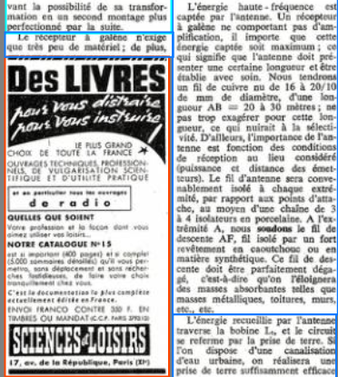|
| AdvertisementZone (red)   MainZone:P (dark blue) | |

## DigitizationArtefactZone
### 1. Definition
DigitalArtefactZone: contains any types of item external to the document itself present on the image because of the digitisation process.
### 2. Subtypes
None
### 3. Examples
| Type | Example | 
| -------- | ------- |
| DigitizationArtefactZone | 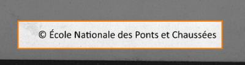 |
| DigitalArtefactZone (orange)   RunningTitleZone (pink)   MainZone:P/P#Continued (blue/light blue)| 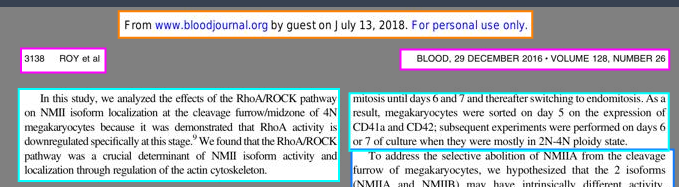

## DropCapitalZone
### 1.Definition
DropCapitalZone: contains any type of initial letter occupying a space corresponding to several lines of the main text or bearing  significant ornementation, be they historiated, ornated, flourished or painted initials (and excluding the following text line).
### 2.Subtypes
None
### 3. Examples
| Type | Example | 
| -------- | ------- |
| DropCapitalZone (purple)   MainZone:P (blue) | 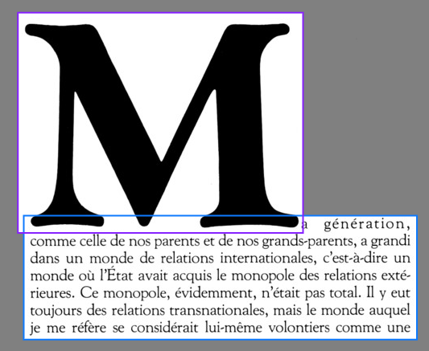 |

## FigureZone
### 1.Definition
Figurezone corresponds to a frame containing textual elements defined by a title and/or a legend. It is used for screens of code.
### 2.Subtypes
   - FigureZone:Head: FigureZone's main caption
   - FigureZone:FigDesc: FigureZone's secondaries captions
### 3.Examples
| Type | Example | 
| -------- | ------- |
| FigureZone (dark green)  FigureZone:Head (middle green)   FigureZone:FigDesc (light green - note) | 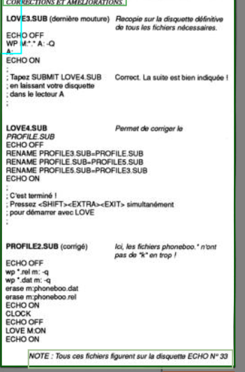|
| FigureZone (green)   MainZone:P (blue) | 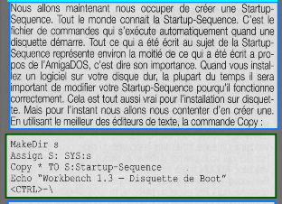|

## GraphicZone
### 1. Definition
GraphicZone: a zone containing any type of graphic element, from purely ornamental information to information consubstantial to the text (e.g. full-page paintings, line-fillers, marginal drawings, figures, etc.). Captions and text contained by the image, if there are any, are part of this zone. The elements contained in a graphicZone must be GraphicZone:Elements.
### 2. Subtypes
   Values used:
   - GraphicZone:Head: GraphicZone's main caption (usually, in scientific paper, the part preceded by Figure X:)
   - GraphicZone:FigDesc :GraphicZone's secondaries captions. A GraphicZone:FigDesc can only be present if a GraphicZone:Head has already been used. A GraphicZone:FigDesc encompasses secondary explanation (usually a small paragraph below a GraphicZone:Head) or serves as names for Part of the GraphicZone (a figure with two different plot and two plot titles on top of the main caption).
   - GraphicZone:TextualContent: Text in an illustration which is not a caption. Usually a commentary and explanation on the illustration. When it is possible, the GraphicZone:P is included in the principle GraphiZone.
   - GraphicZone:Part : a graphic element (photography, plot, etc...) defined as a sub-element of a GraphicZone containing at least one graphic (picture, schema, plot, etc.) and one element identifying it as a part of a whole (a GraphicZone:FigDesc or a NumberingZone)
   - GraphicZone:Decoration: a graphical element decorating the text, such as separator ornament.
   - GraphicZone:Maths: Mathematical Formula separated from the main text. This doesn't apply to formula within the text but can be used to described chemical formulas. A GraphicZoneMaths can be associated with a GraphicZone:Legend.

### 3. Examples
| Type | Example | 
| -------- | ------- |
| GraphicZone (brown)   GraphicZone:head (red)   GraphicZone:Figdesc (orange)| 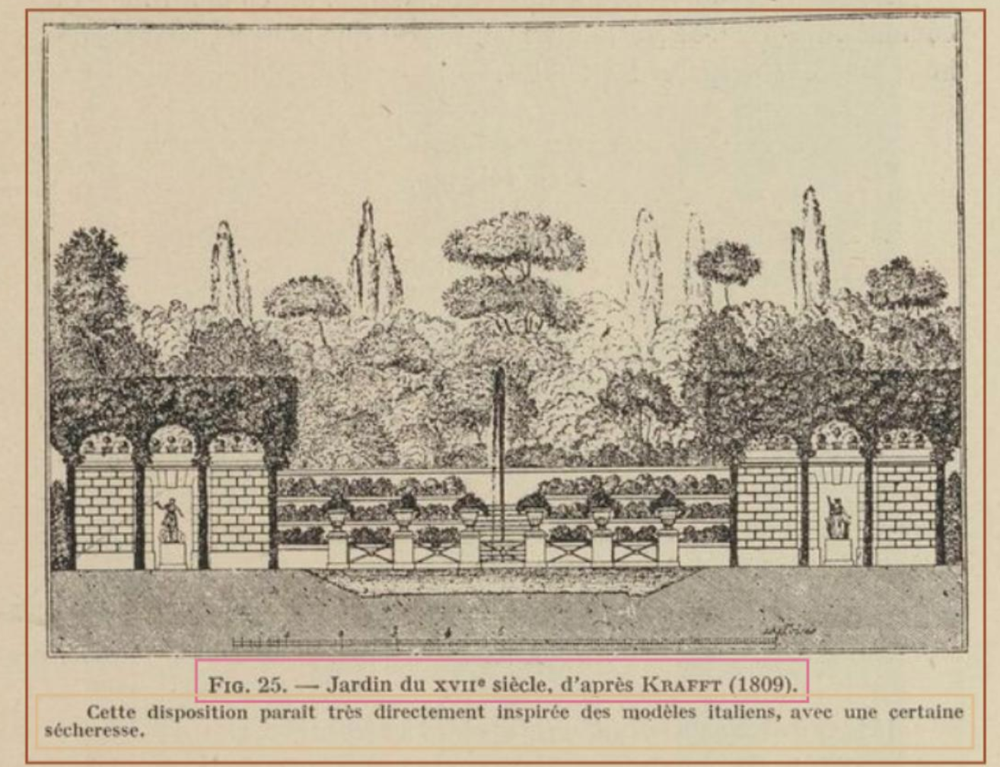|
| GraphicZone (brown)  GraphicZone:head (grey)   GraphicZone:FigDesc (orange)   GraphicZone:TextualContent (text in green) | 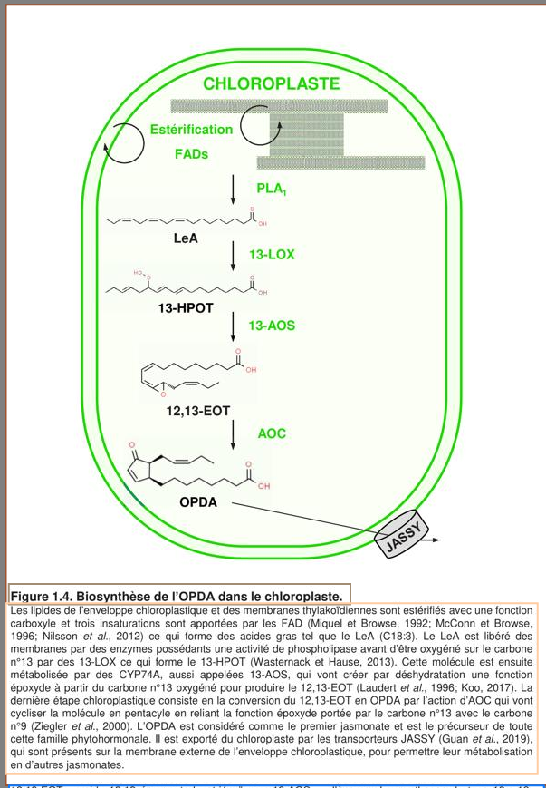 |
| GraphicZone (brown)   GraphicZone:head (red)   GraphicZone:FigDesc (pink) |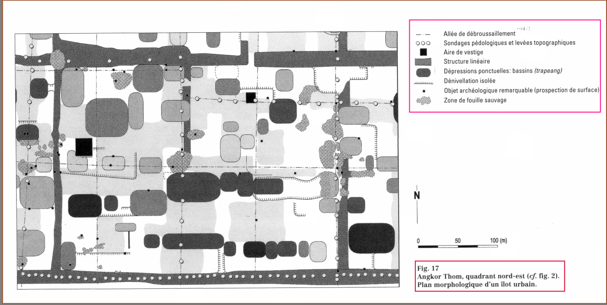|
| GraphicZone (brown)   GraphicZone:head (red)   GraphicZone:Legend (Credits/Red)| 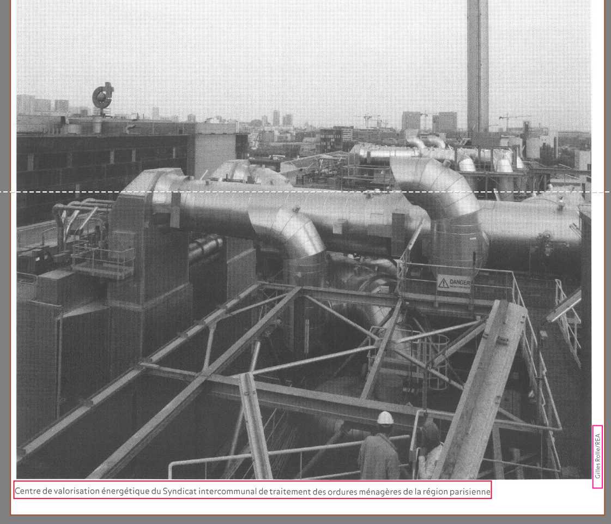|
| GraphicZone (brown) |  |
| GraphicZone (brown)   GraphicZone:head (grey)   GraphicZone:Part (Light Brown)   NumberingZone (number in white)| 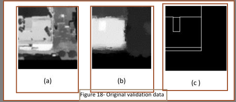 |
| GraphicZone:Decoration (orange)   MainZone:Head (yellow) | 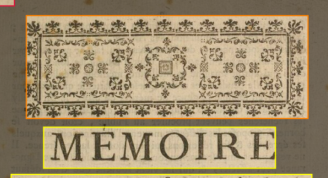 |
| GraphicZone:Decoration (orange)   MainZone:Head (yellow) | 
| GraphicZone:Maths (grey)   NumberingZone (red)   MainZone:P (dark blue)   MainZone:P (light blue) | 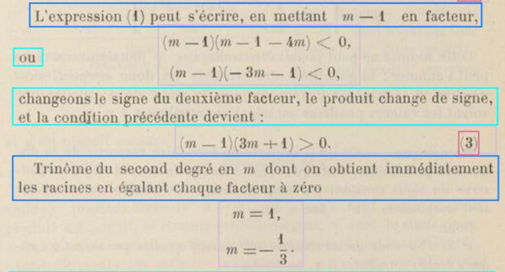 |

## MainZone
### 1. Definition
MainZone is the main area containing the text, excluding any paratext, and it is either a single block or multiple columns. When a page is divided into columns or blocks, each one is a different zone. 

### 2. Subtypes
| Type | Continued | Definition |
| ---- | --------- | ---------- |
| MainZone:Head | No | A header separated from the rest of the text. A mainZone:Head should not overlap with a MainZone:P. |
| MainZone:P | Yes | A normal paragraph of text. MainZone:P#Continued allows to annotate a paragraph that begin on another page or was interrupted by another zone such as graphicZone. MainZone:P and MainZone:P#Continued should not overlap with a MainZone:Head. |
| MainZone:Lg | Yes | A group of verses lines, used mostly for poems. MainZone:Lg#Continued allows to annotate a paragraph that begin on another page or was interrupted.|
| MainZone:Sp | Yes | A dialog element, mostly for theatre. It must contain the speaker's name, stage directions and a graphical element separating the speaker's name from his speech.
| MainZone:List | Yes |  A list item. MainZone:List#Continued allows to annotate a liste item that begin on another page or was interrupted.|
| MainZone:Entry | Yes | A specific item featuring a piece of information, structured using typographic elements and organized systematically, often alphabetically or numerically. It should not complete sentences, and the structure of the item should be repeated in the document. Used for catalogs or bibliographic entries.|
| MainZone: Form | No |  A structured template to collect information, separated from the rest of the mainzone. |
| MainZone: Date | No | A date in a correspondance or an article. The date should be visually recognizable due to its geographical position in the page rather than its meaning.
| MainZone: Signature | No | A textual signature, graphically separated from the rest of the mainzone, usually at the bottom right of a text or head. Used for the author's name in a correspondance or in a article. |
| MainZone:Other | No | If none of the other mainZone can be used.|
     
### 3. Examples
| Type | Example | 
| -------- | ------- |
| MainZone:P |  |
| MainZone:Lg | 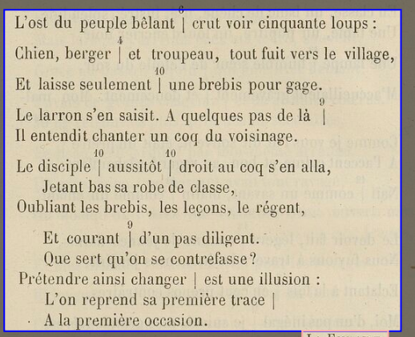|
| MainZone:Sp | 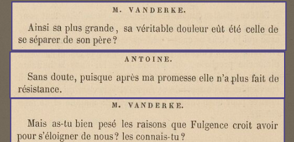|
| MainZone:List | 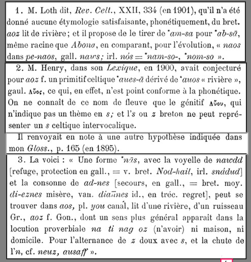 |
| MainZone:Entry | 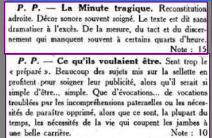 |
| MainZone: Entry | 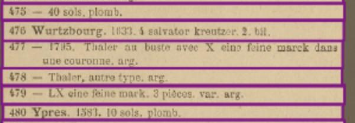 |
| MainZone:Entry (red)   NumberingZone(red)   Signature (dark purple)   MainZone:P (green)   RunningTitleZone (pink)| 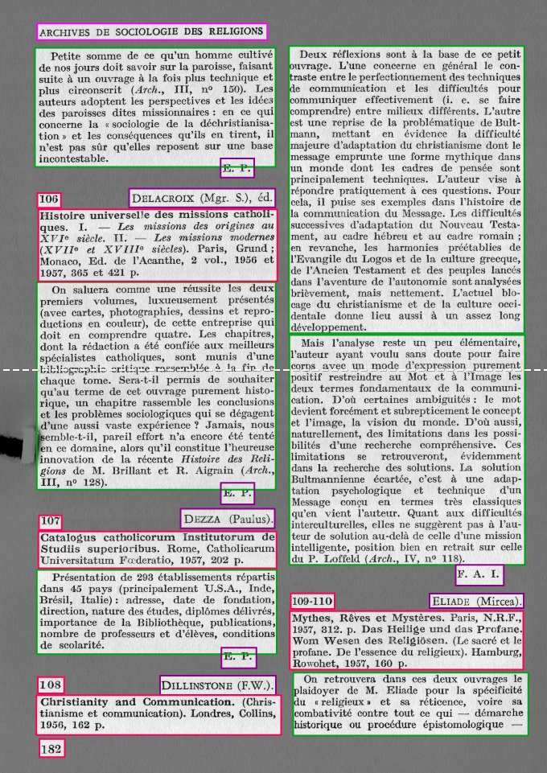|
| MainZone:Form | 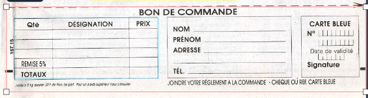 |
| MainZone:Head (yellow)   MainZone:Date (grey)   MainZone:P (blue) | 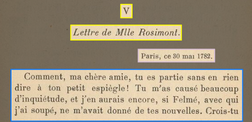 |
| MainZone:Head (yellow)   MainZone:Signature (brown)   MainZone:P (blue) | 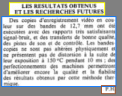 |
| MainZone:Head (yellow)   MainZone:Signature (brown)   MainZone:P (blue) | 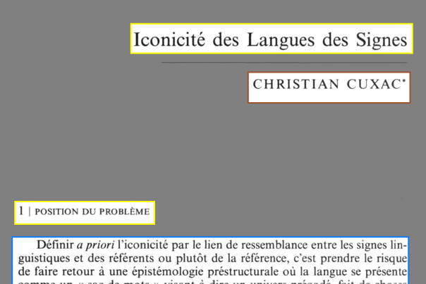|

## MarginTextZone
### 1. Definition
MarginTextZone: characterises any text zone contained in the margins no matter its position on the page (upper, lower, inner or outer), including the space between two columns. We do not differentiate the zone's particular semantic status (gloss, addition, correction, intertextual or bibliographic reference…).
### 2. Subtypes
   - MarginTextZone:ManuscriptAddendum: A handwritten margin note.
   - MarginTextZone:Notes, MarginTextZone:Notes#Continued: Footnotes and Margin Notes (not separated invidually). MarginTextZone:Notes#Continued is used when there are multiple columns of notes on the page.
### 3. Examples
| Type | Example |
| ---- | ------- |
|MarginTextZone:Notes (light blue)   MainZone:P (blue)   GraphicZone (brown) |  |
|MarginTextZone:Notes (light blue)   MainZone:P (green) | 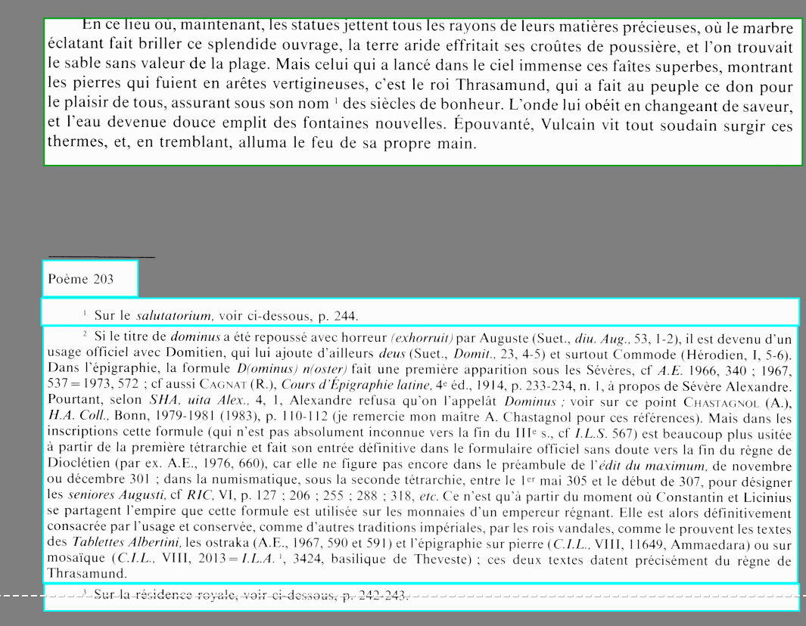|
|MarginTextZone:ManuscriptAddendum| 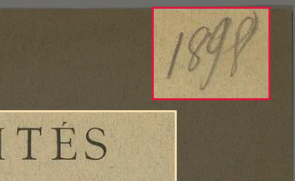|

## NumberingZone
### 1. Definition
NumberingZone is a zone containing the page, the folio, or the document number, with no regard for the mark's origin (scribe, curator, etc). The zone usually is at the top of the page.
### 2. Subtypes
None
### 3. Examples
| Type | Example |
| ---- | ------- |
| NumberingZone (red)   RunningTitleZone (pink)   MainZone:Lg (purple) | 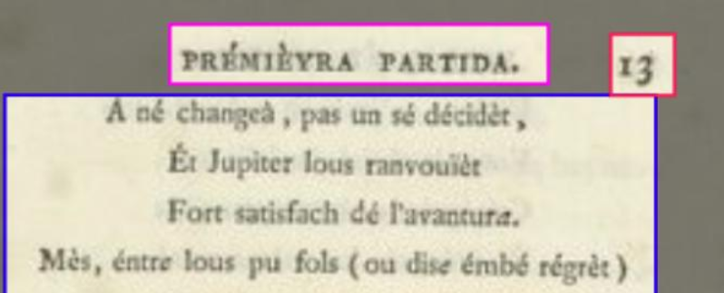|
| NumberingZone (red)   GraphicZone:Part (brown) |  |

## PageTitleZone
### 1. Definition
PageTitleZone: characterises the entire page, rather than a section within a page, that contains for instance headings (chapter title, act or scene number, etc.). It is distinct from other pages and is traditionally the first page of a document, especially in the case of prints. It provides bibliographic or identifying information, such as the title of the work, the production date, the names of the printer(s), publisher(s) and author(s), etc. This area normally contains HeadingLine. Information added a posteriori (for example by the librarian) is in a MarginTextZone.
### 2. Subtypes
   - PageTitleZone:Index : Summary, Table of contents and index of graphics that can not be separated.
### 3. Examples
| Type | Example |
| ---- | ------- |
| PageTitleZone (yellow)   StampZone (green) |  |
| PageTitleZone:Index (Neon green)   NumberingZone (red)  RunningTitle (pink)   Stamp (green)| 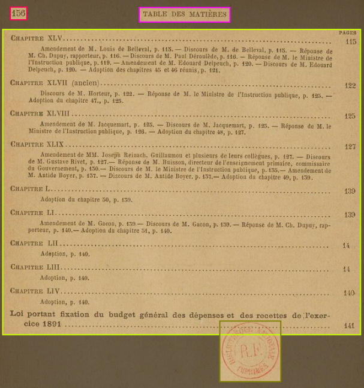|

## QuireMarkZone
### 1. Definition
QuireMarksZone: is a zone containing a quire signature (e.g. a ii), catchword, or any kind of element relative to the material organisation of the source, with the exclusion of page, folio, or item numbers. The zone usually is at the bottom of the page.
### 2. Subtypes
None
### 3. Examples
| Type | Example |
| ---- | ------- |
| Quiremarks (dark blue)   MainZone (blue) | 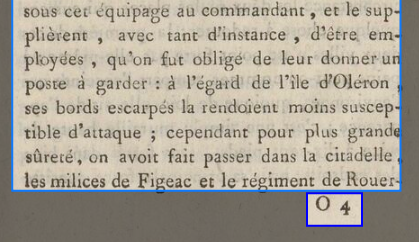|
| Quiremarks (blue)   NumberingZone (red)   MainZone:P#Continued (blue) | 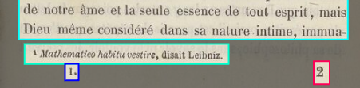|

## RunningTitleZone
### 1. Definition
RunnningTitleZone: is a zone containing a running title, traditionally at the top of the page or of the double page. It can be the title (or the abbreviated title) of a document or of the current section.
### 2. SubTypes
None
### 3. Examples
| Type | Example |
| ---- | ------- |
| NumberingZone (red)   RunningTitleZone (pink)   MainZone:Lg (purple) | |

## StampZone
### 1. Definition
StampZone: is a zone containing a stamp, be it a library stamp or a mark from a postal service.
### 2. Subtypes
   - StampZone:Sticker: A sticker identifying the book (usually with a code)
### 3. Examples
| Type | Example |
| ---- | ------- |
|StampZone (green)   StampZone:Sticker (brown)   PageTitleZone (beige) | 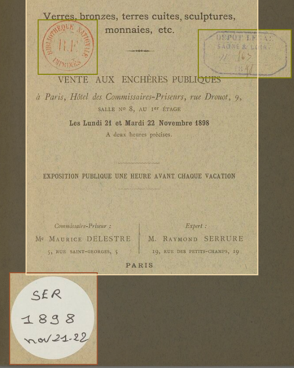|

## TableZone
### 1.Definition
TableZone: is a zone containing a table of any kind. The table can be clearly drawn (with rows and columns) or not. The tables of contents are in the vast majority of cases not tables.
Caption should be included. If there is some text not contained by the graphical form of the table but it is appart of the table, include it in the tableZone.
### 2.Subtypes
   - TableZone:Head: The caption of the table. Should be contained by the tableZone.
### 3.Examples
| Type | Example |
| ---- | ------- |
| TableZone (middle blue)   NumberingZone (red)  MainZone:P (dark blue)   MainZone:P#Continued (light blue) |  |
| TableZone (blue) | 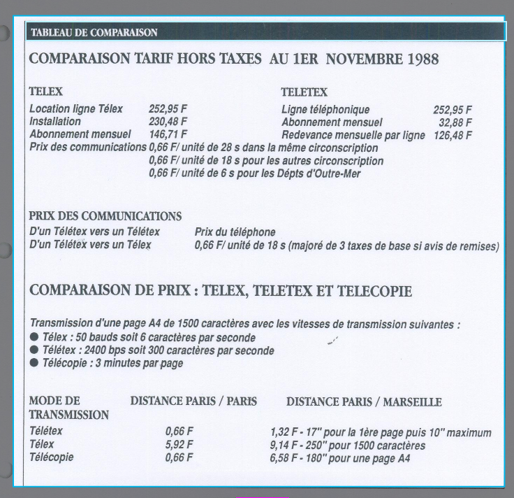 |
| TableZone (dark blue)   TableZone:Head (light blue) | 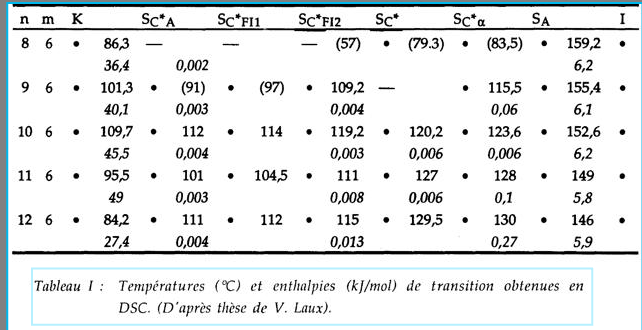|

