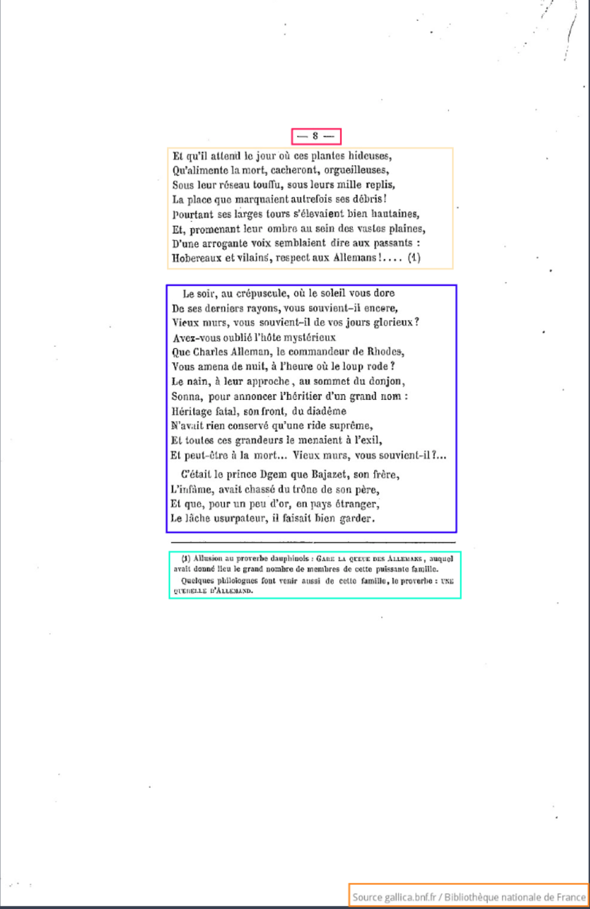
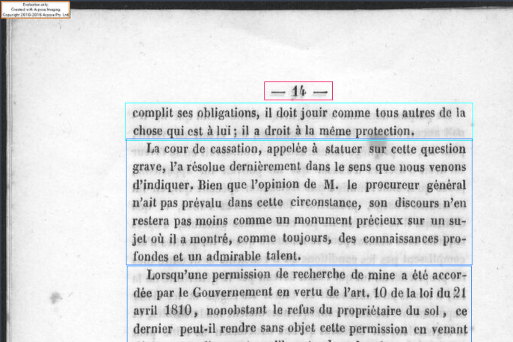
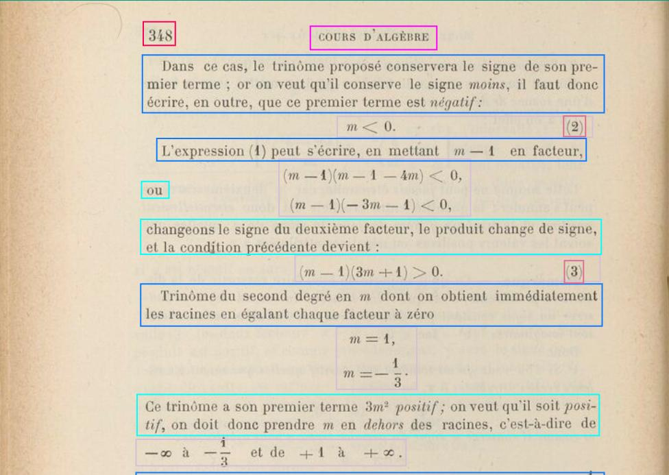
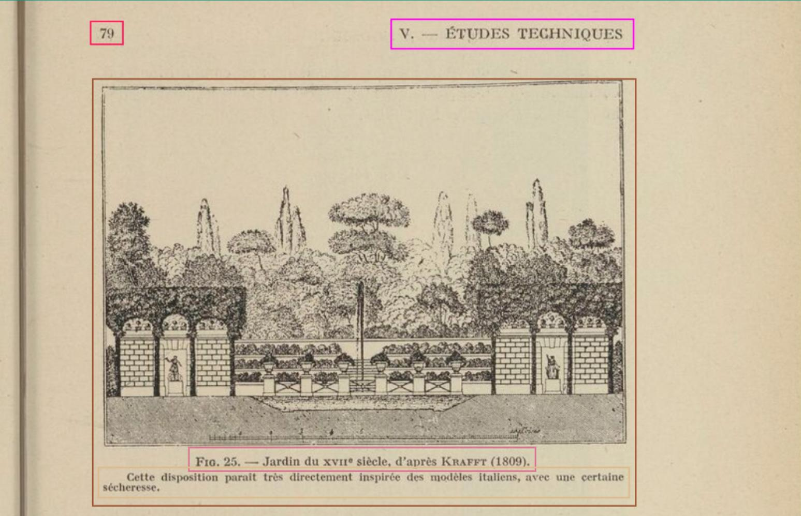
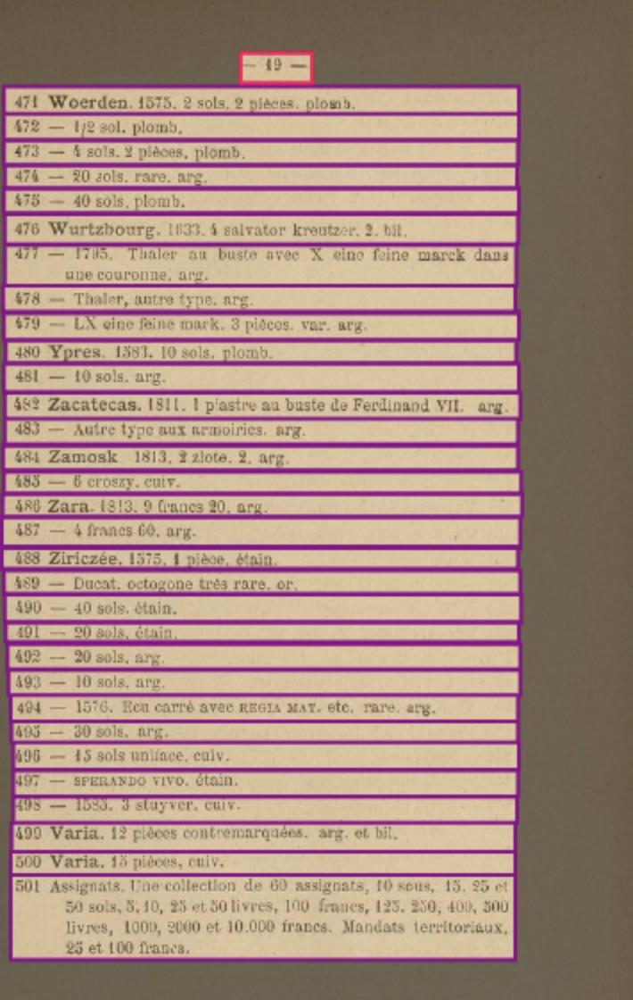
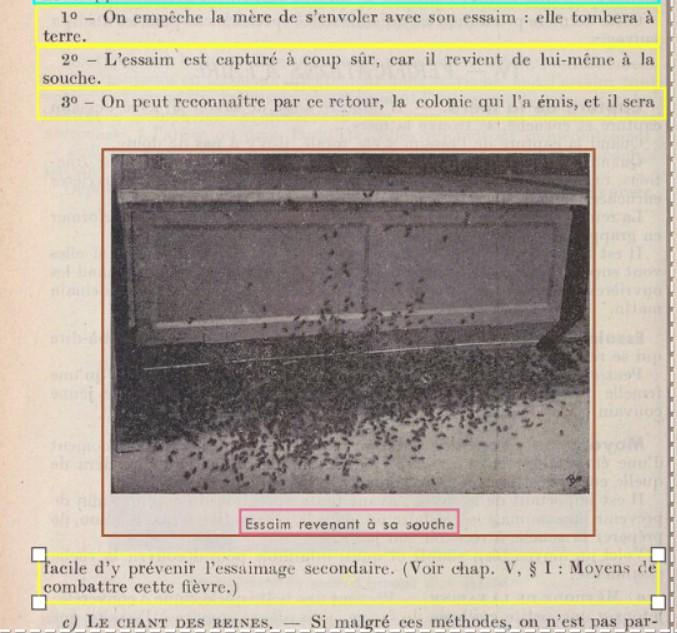
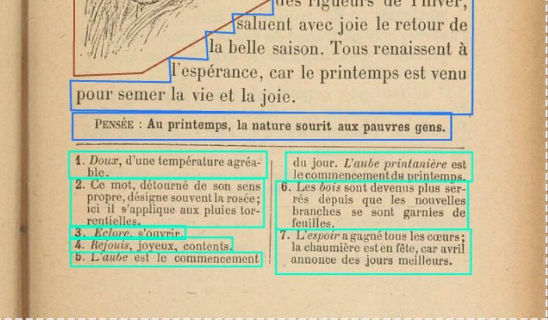
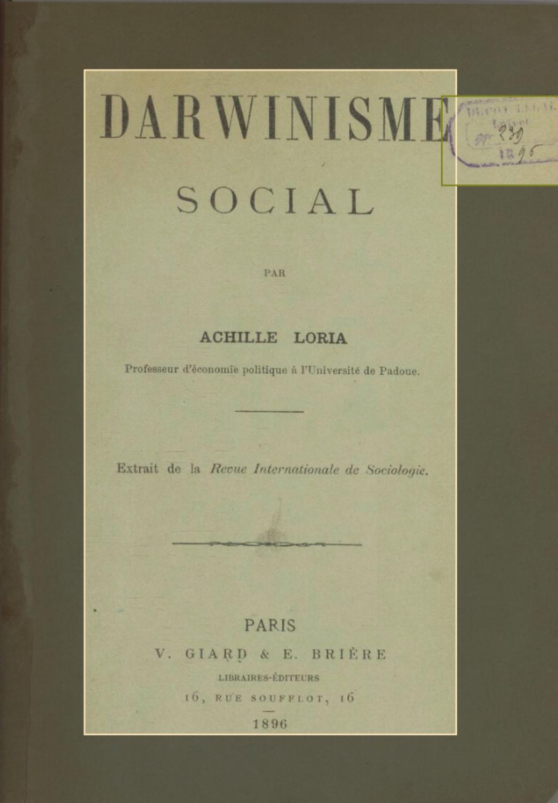
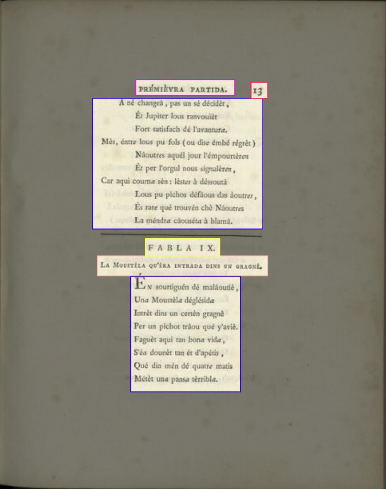
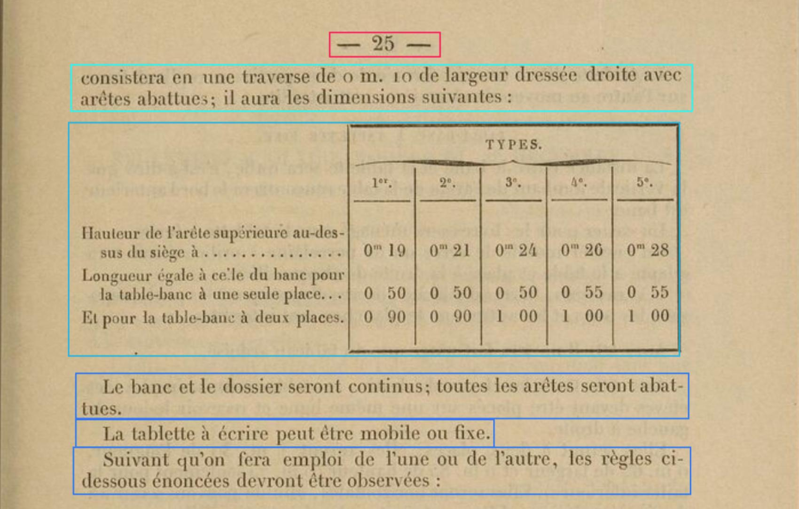

# Annotation Guide

## DigitizationArtefactZone
All the elements resulting from the digitalization process (for example watermarks of the institution preserving the document or fingers)

The digitalizationartefactZone is in orange. 
Right: Le_Prince_Dgem_chronique_dauphinoise_-----Arnaud_Victor_bpt6k5468703r_11.jpeg  
Left: bpt6k1092529g_f14.jpg

## DropCapitalZone

A `DropCapitalZone` is used for initial letters that takes more than the size of one line, specifically if this clearly modifies
the overall layout.

## GraphicZone
Include all the figure (photography, plot, drawing) and its caption.

## GraphicZone:Part

A graphic element (photography, plot, etc.) defined as one of the two following options:

1. a sub-element of a `GraphicZone` containing at least one graphic (picture, schema, plot, etc.) and one element identifying it as a part of a whole (a `GraphicZone:FigDesc` or a `NumberingZone`)
2. a sub-element of a `TableZone`

## GraphicZone:Decoration
Graphical element decorating the text, such as separator ornament.

## GraphicZone:Head

`GraphicZone`'s main caption (usually, in scientific paper, the part preceded by `Figure X:`)

## GraphicZone:FigDesc

`GraphicZone`'s secondaries captions. 

A `GraphicZone:FigDesc` can only be present if a `GraphicZone:Head` has already been used.

A `GraphicZone:FigDesc` encompasses secondary explanation (usually a small paragraph below a `GraphicZone:Head`) or serves as names
for Part of the `GraphicZone` (a figure with two different plot and two plot titles on top of the main caption).

## GraphicZone:Maths
Mathematical Formula separated from the main text. This doesn't apply to formula within the text. A GraphicZoneMaths can be associated with a GraphicZone:Legend.

 

Example: bpt6k1421246p_f358.jpg

Geometric Illustration are not GraphicZone:Maths but rather simple GraphicZone.

 

Example :  bd6t5371525p_f68.jpg

## GraphicZone:TextualContent

Text in an illustration which is not a caption. Usually a commentary and explanation on the illustration. When it is possible, the graphicZone:P is included in the principle GraphiZone.

 

Example : bd6t53682106_f109.jpg

## MainZone:Date
A date in a correspondance or an article. The date should be visually recognizable due to its geographical position in the page rather than its meaning.

## MainZone:Entry, MainZone:Entry#Continued
A catalogue's entry. Graphically, an entry is usually defined by a typographic elements (italic, bold) and a structuration (alphabetical, numerical..).

 

Example : bd6t5369916x_f31.jpg

## MainZone:Form

A form.

## MainZone:Head

A header separated from the rest of the text.
A MainZone:Head should not overlap with a MainZone:P or MainZone:P#Continued.

## MainZone:Lg, MainZone:Lg#Continued

A group of verses lines.

## MainZone:List, MainZone:List#Continued

A list item. MainZone:List#Continued allows to annotate a liste item that begin on another page or was interrupted.

 

Example : bd6t53771507_f86.jpg

## MainZone:Other

When none of the mainZone can be used.

## MainZone:P, MainZone:P#Continued

A normal paragraph of text. MainZone:P and MainZone:P#Continued should not overlap with a MainZone:Head.

## MainZone:Signature

A signature (For example, in a correspondance, the authors' name). It should be graphically separated from the rest of the text.

## MainZone:Sp, MainZone:Sp#Continued

A dialog element, mostly for theatre. It must contain the speaker's name, stage directions and a graphical element separating the speaker's name from his speech.

## MarginTextZone:ManuscriptAddendum

A handwritten margin note.

## MarginTextZone:Notes, MarginTextZone:Notes#Continued

Footnotes and Margin Notes (not separated invidually). MarginTextZone:Notes#Continued is used when there are multiple columns of notes on the page.

 

Example: bd6t53717102_f63.jpg

## NumberingZone

Page Number

## PageTitleZone

A group of text segments creating a title page not contained in the mainZone.

 

Example: bd6t5372200f_f3.jpg

## PageTitleZone:Index
Table of contents

## QuireMarkZone

## RunningTitleZone

A (complete or abbreviated) title outside of the main text, usually placed at the top of the page.

 

RunningTitleZone is in pink. 
Example: bpt6k10981259_f27.jpg

## StampZone

## StampZone:Sticker

A sticker identifying the book (usually with a code)

## TableZone

A table, caption included. It should contain all the table.
If there is some text not contained by the graphical form of the table but it is appart of the table, include it in the tableZone.

 

Example : bd6t53701166_f31.jpg

## TableZone:Legend
The caption of the table

