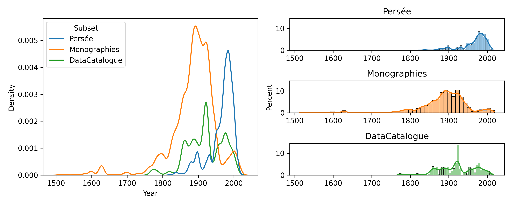
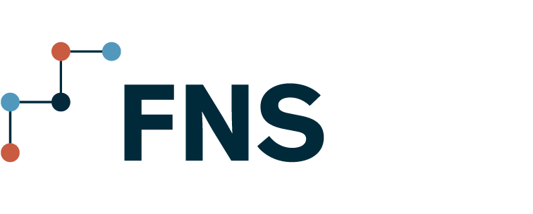

# Layout Analysis Dataset with SegmOnto (LADaS)

 

LADaS, created by the [ALMANaCH team-project](https://almanach.inria.fr/index-en.html) at Inria,
continued in partnership with other researchers, is a multidocuments diachronic layout analysis 
dataset. This dataset includes:

- Monographs from the Bibliothèque Nationale de France (17th century - today);
- PhD Thesis, in various fields (not only STEM, 20th-21st century);
- Selling Catalogs (for manuscripts and art pieces), in various fields (18th-20th century);
- Noisy digitization (with fingers for example, 20th-21st century);
- Academic papers (mostly Humanities and Social Sciences) (19th-21st century);
- Magazines about technologies and video games, from 1920s to 2010;
- Misc stuff found here and there.

The data are in YoloV8 txt format (class center_x center_y width height).

The script in document is mostly Latin script, and language is mostly French with some representation of the main
western academic languages.

### Annotation

Label Annotation have been conducted using the [SegmOnto](https://segmonto.github.io/) vocabulary. 
An annotation guide is available [here](AnnotationGuide.md).

### More details about some subsets

*Last update of the plot: 15/12/2023*

## Structure

The data can be found in `./data`. Each subset is present in its own subset folder if you want to train cross-genre.

A script, `collate.sh` allows for having a single directory with train/dev/test folders for YoloV8 training.

## Partners
|Funding|Project|Comment|
|---|---|---|
|||Originally established and funded as part of the DEFI COLaF (2023–2027).|
|||Funded by the European Union under Grant Agreement n. 101132163. Views and opinions expressed are however those of the author(s) only and do not necessarily reflect those of the European Union. Neither the European Union nor the granting authority can be held responsible for them. |
||The Geographic Horizon of writers|Funded by FNS-Spark project [N°220833](https://data.snf.ch/grants/grant/220833). |

## Licence

## Citation

See the CITATION.CFF file

## Contact

Thibault Clérice ( th[a-z]+.cle[a-z]+ [at] inria.fr)
